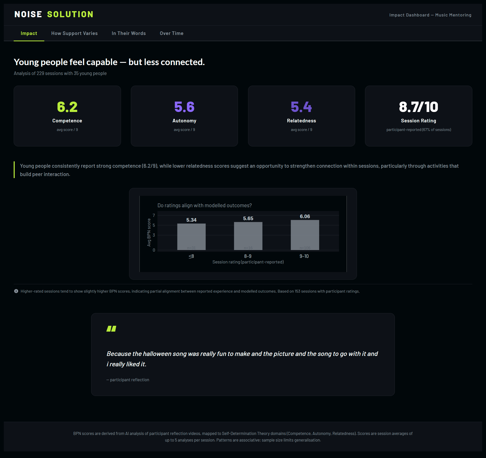
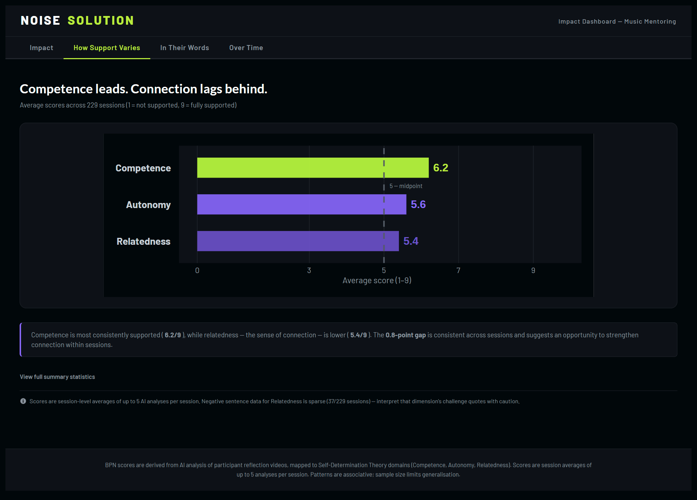
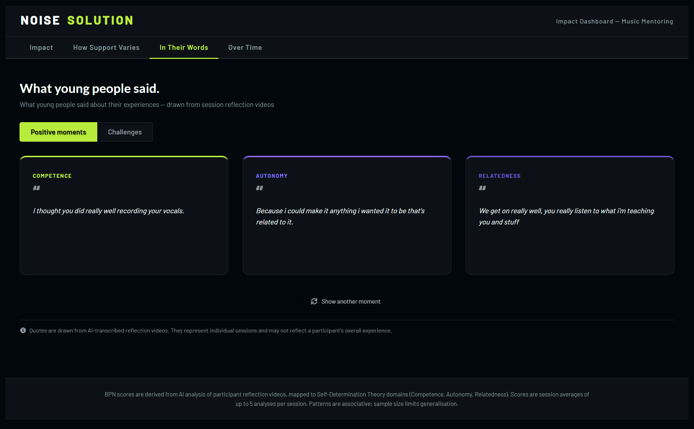
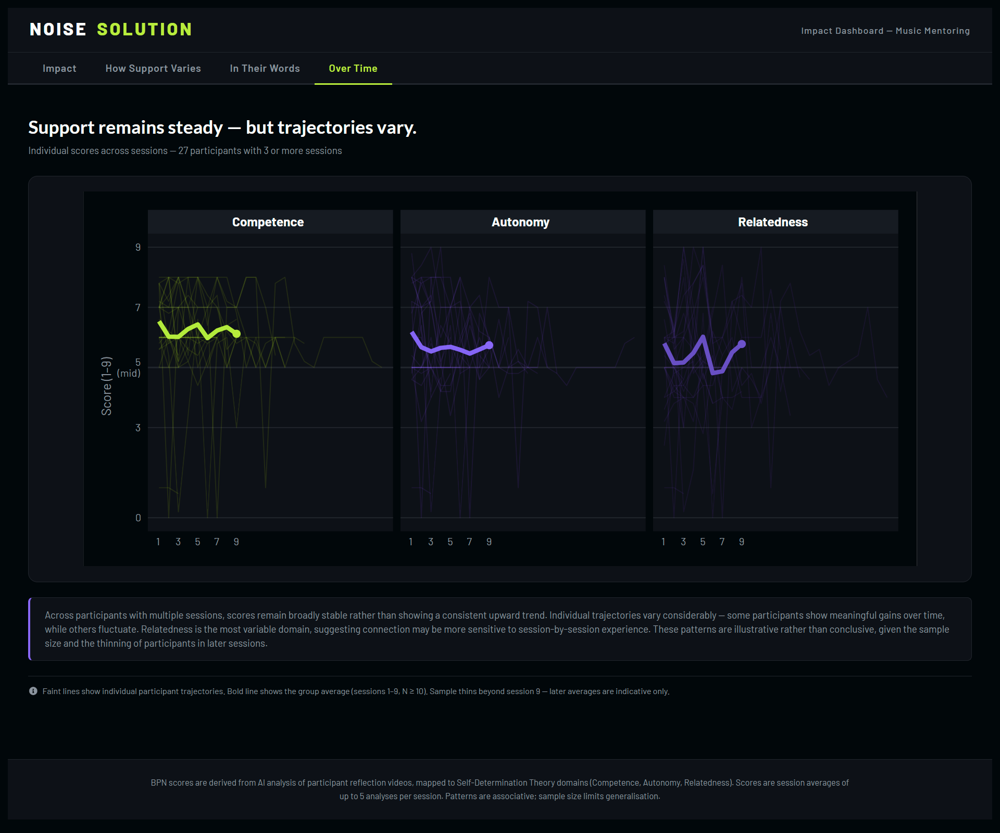

# Noise Solution Impact Dashboard

*A pro bono analytics submission for the Data ChangeMakers volunteer programme*

    

------------------------------------------------------------------------

## Overview

[Noise Solution](https://www.noisesolution.org/) is a UK-based charity that uses digital music mentoring to support young people facing significant barriers — including mental health challenges, exclusion from education, and social isolation. Mentors work one-to-one with participants, using music creation as the medium for building psychological wellbeing.

This dashboard visualises program outcomes across **229 sessions with 35 young people**, using an AI-assisted pipeline to derive structured psychological scores from qualitative session notes. Scores are grounded in **Self-Determination Theory (SDT)** — a well-validated framework in which wellbeing depends on the satisfaction of three Basic Psychological Needs: Competence, Autonomy, and Relatedness.

The goal is not to claim impact through statistics alone, but to make patterns in qualitative data visible, honest, and useful for program reflection.

------------------------------------------------------------------------

## Live Dashboard

🔗 **Interactive Shiny dashboard:**\
[Noise Solution Impact Dashboard](https://0l6jpd-steven-ponce.shinyapps.io/noise-solution-impact/) (ShinyApps.io)

------------------------------------------------------------------------

## Dashboard Preview

### Impact

\
*Four KPI cards (Competence, Autonomy, Relatedness, Session Rating) with a takeaway sentence and a rating/BPN alignment chart. Hero quote drawn directly from session notes.*

### How Support Varies

\
*Horizontal bar chart showing average BPN scores across the three domains, with a midpoint reference line and a collapsed summary table.*

### In Their Words

\
*Participant quotes organised by sentiment (Positive / Challenges) and BPN domain. Toggle between states; three representative quotes per domain.*

### Over Time

\
*Small multiples line chart tracking individual BPN trajectories across sessions 1–9. Individual lines (alpha 0.11) with an average overlay where N ≥ 10.*

------------------------------------------------------------------------

## Data Pipeline

Session notes were qualitative — free-text records written by mentors after each session. To make these analytically useful without losing nuance, an AI-assisted scoring pipeline was applied:

1.  **Raw notes** — Free-text mentor session records (229 sessions)
2.  **AI scoring** — Claude (Anthropic) reviewed each note and assigned BPN scores (1–9 scale) for Competence, Autonomy, and Relatedness, along with representative quotes and sentiment classification
3.  **Structured output** — Scores, quotes, and session metadata compiled into a tidy dataset
4.  **Dashboard** — Patterns visualised across four analytical tabs

**Important guardrails:** - Scores reflect AI interpretation of qualitative notes — they are not self-reported by participants - The pipeline introduces subjectivity at the AI scoring stage; results should be read as structured summaries, not clinical measurements - Relatedness negatives are sparse (37 / 229 sessions), reflecting the nature of one-to-one mentoring

------------------------------------------------------------------------

## Key Findings

| Metric | Value | Context |
|----|----|----|
| Competence | 6.2 / 9 | Highest BPN domain — participants feel capable |
| Autonomy | 5.6 / 9 | Mid-range — creative agency present but variable |
| Relatedness | 5.4 / 9 | Lowest domain — connection scores lag capability scores |
| Session Rating | 8.7 / 10 | High satisfaction; 153 / 229 sessions with ratings |

The pattern — high competence, lower relatedness — suggests the program is effective at building skill and confidence, while peer and community connection may represent an opportunity for program development.

Trajectories over time are largely flat across sessions 1–9, which is an honest finding: the data does not support claims of improvement over time at the aggregate level.

------------------------------------------------------------------------

## What This Dashboard Does *Not* Do

To avoid overreach, this dashboard explicitly does not:

-   Claim causal evidence of wellbeing improvement
-   Provide clinical or diagnostic assessments
-   Substitute for participant self-report measures
-   Generalise beyond the 35 participants in this dataset
-   Present AI-derived scores as equivalent to validated psychometric instruments

------------------------------------------------------------------------

## Technology Stack

| Component     | Technology                   |
|---------------|------------------------------|
| Language      | R (4.3+)                     |
| Framework     | Shiny (modular architecture) |
| UI components | shiny.semantic (Appsilon)    |
| Visualization | ggplot2, ggiraph             |
| Tables        | reactable                    |
| Deployment    | shinyapps.io                 |

------------------------------------------------------------------------

## Design Principles

-   **Honest reporting** — flat trajectories reported as flat, not reframed as stability
-   **Qualitative first** — quotes and participant voice treated as primary, not decorative
-   **Appropriate restraint** — AI pipeline limitations disclosed upfront in the About modal
-   **Decision support, not proof** — patterns surfaced for program reflection, not advocacy

------------------------------------------------------------------------

## Repository Structure

```         
noise_solutions/
├── app/
│   ├── app.R                        # Entry point
│   ├── global.R                     # Packages, data, colour palette
│   ├── ui.R                         # Main UI definition
│   ├── server.R                     # Server logic
│   ├── DESCRIPTION                  # Package dependencies for shinyapps.io
│   ├── modules/
│   │   ├── mod_impact_overview.R    # Tab 1 — Impact
│   │   ├── mod_bpn_deep_dive.R      # Tab 2 — How Support Varies
│   │   ├── mod_voices.R             # Tab 3 — In Their Words
│   │   └── mod_journey.R            # Tab 4 — Over Time
│   ├── data/                        # Processed .rds files (raw data not included)
│   └── www/
│       └── styles.css
├── screenshots/
└── README.md
```

------------------------------------------------------------------------

## How to Run Locally

``` r
# Clone the repo
# Open noise_solutions.Rproj in RStudio

# Install dependencies
install.packages(c(
  "shiny", "shiny.semantic", "dplyr", "tidyr",
  "ggplot2", "scales", "ggiraph", "reactable", "stringr", "glue"
))

# Run the app
shiny::runApp("app")
```

------------------------------------------------------------------------

## Limitations

-   AI-derived scores introduce interpretive subjectivity at the scoring stage
-   Dataset is small (35 participants); patterns may not generalise
-   Relatedness negatives are sparse, limiting reliability of that domain's challenge quotes
-   Session coverage is uneven across participants (range: 1–24 sessions)
-   No control group; observed patterns cannot be attributed to the program alone

------------------------------------------------------------------------

## Author

**Steven Ponce**\
Data Analyst \| R Shiny Developer \| Pharmaceutical Analytics

-   🔗 Portfolio: [stevenponce.netlify.app](https://stevenponce.netlify.app)
-   🐙 GitHub: [\@poncest](https://github.com/poncest)
-   💼 LinkedIn: [stevenponce](https://www.linkedin.com/in/stevenponce)
-   🦋 Bluesky: [\@sponce1](https://bsky.app/profile/sponce1.bsky.social)

------------------------------------------------------------------------

## License

Released under the MIT License.

------------------------------------------------------------------------

## Disclaimer

This project was completed as a **pro bono volunteer contribution** through the Data ChangeMakers programme. It is not affiliated with or endorsed by Noise Solution in an official capacity. All session data was provided by Noise Solution for the purpose of this analysis. No personally identifiable information is included in this repository.

------------------------------------------------------------------------

**Version:** 1.0.0\
**Last updated:** April 2026
